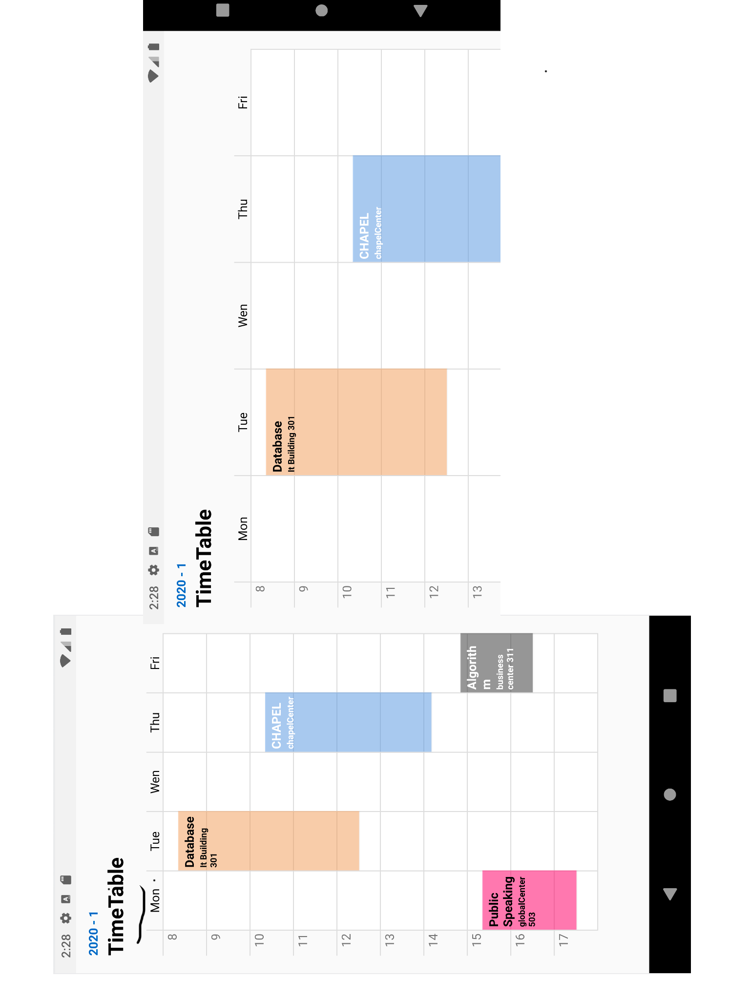
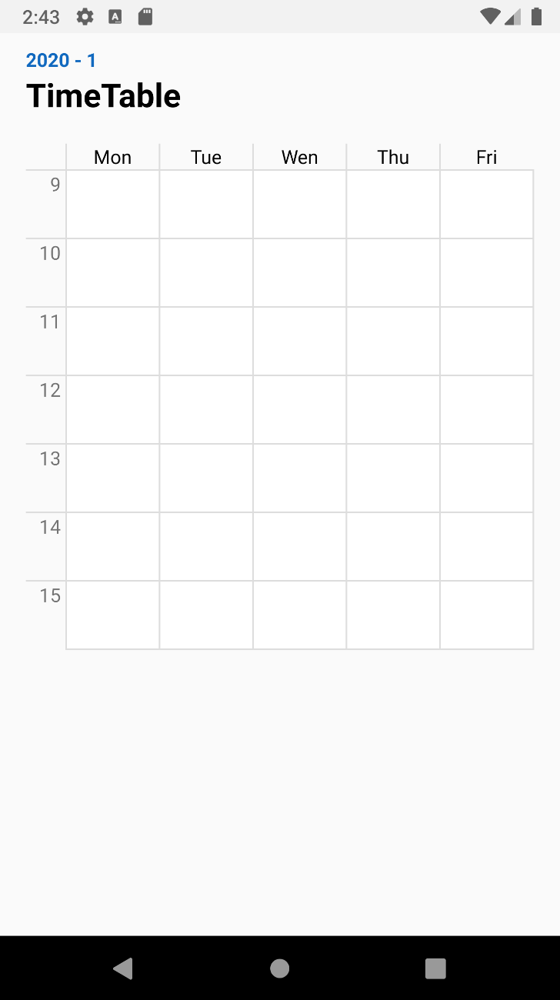
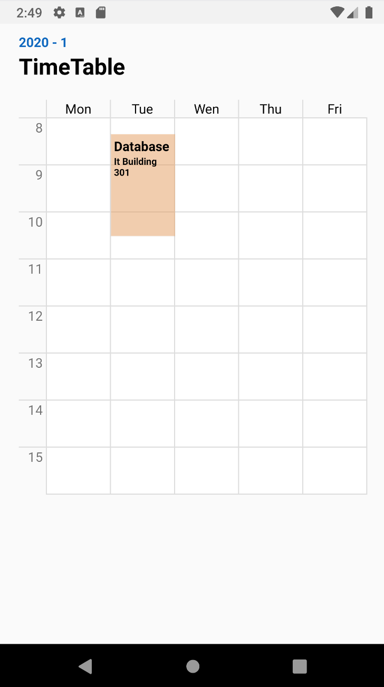
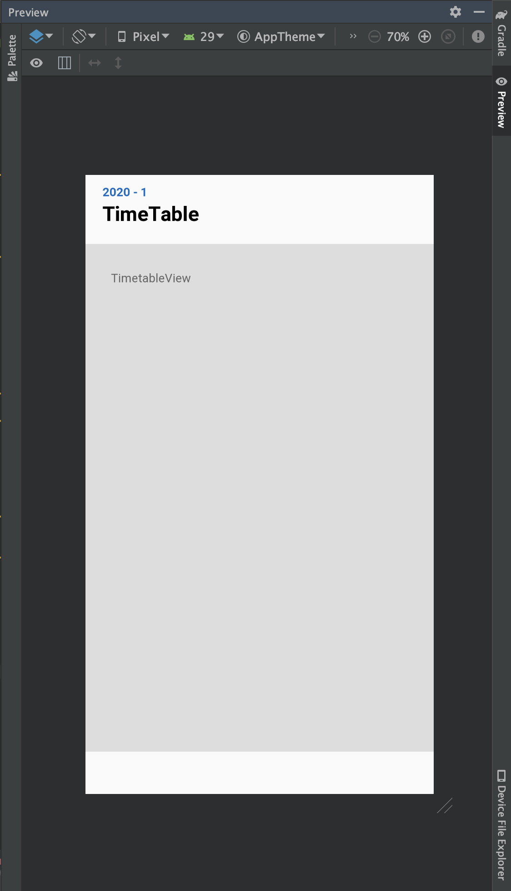
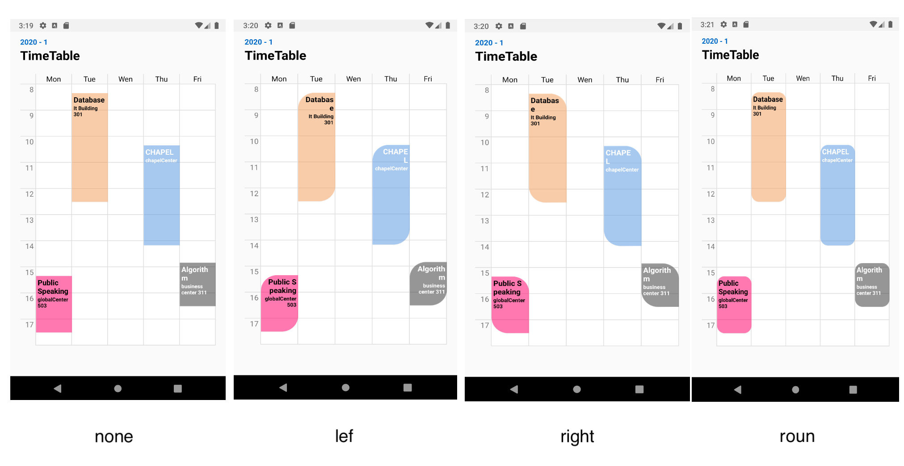
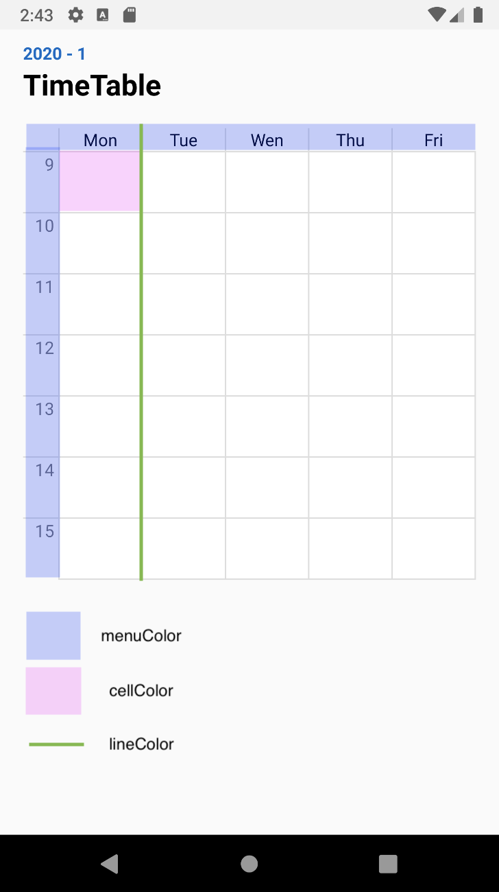
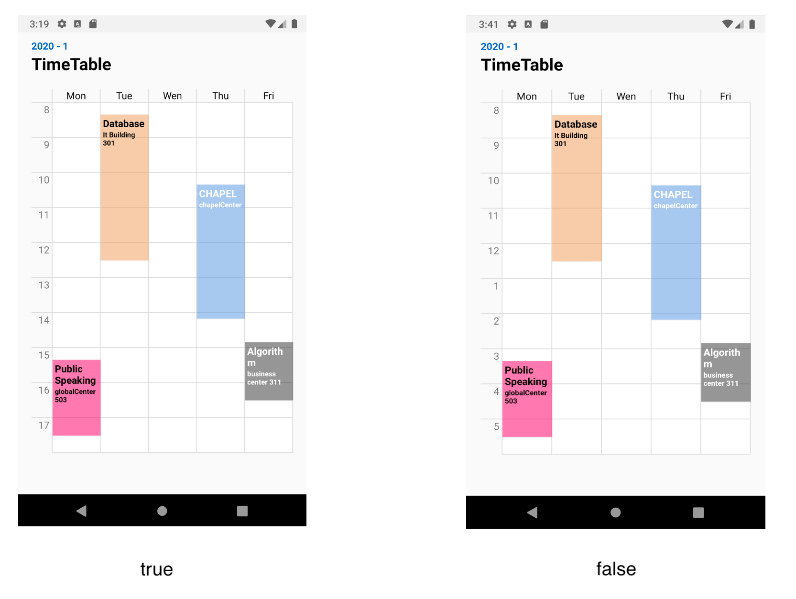
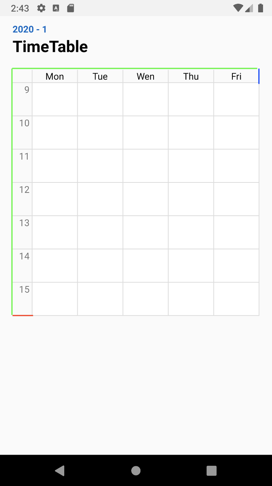

# MinTimetable
MinTimeTable is Customizable library to generate **Timetable** of University.   
If you only add a course, **the course time is automatically calculated** and added to the timetable.   
(default 09:00 ~ 16:00)

## iOS version
[Elliotable](https://github.com/della-padula/Elliotable)  

### Author Information
----   
Timetable Library for Android Development   
Author : Mint Park / Seoul, South Korea   
Email : nasamk3@gmail.com   
  


[](https://opensource.org/licenses/MIT)
[](https://jitpack.io/#islandparadise14/Mintable)

## Screenshot   

#### Portrait & Landscape Timetable   
   

## Installation
### JitPack
MinTimeTable is available through JitPack, to install it simply add the following line to your Gradle:   
```groovy
allprojects {
    repositories {
        ...
        maven { url 'https://jitpack.io' }
    }
}
```
```groovy
implementation 'com.github.islandparadise14:Mintable:x.y.z'
```

## Usage   
### Add View
```xml
<com.islandparadise14.mintable.MinTimeTableView
                android:id="@+id/table"
                android:layout_width="match_parent"
                android:layout_height="wrap_content" />
```

### Day Symbol Definition   
```kotlin
private val day = arrayOf("Mon", "Tue", "Wen", "Thu", "Fri")  
```
### Make Table
override onWindowFocusChanged because we know the size of the view after onCreate is finished.
If you don't want to use this method, see the optimization options below.
```kotlin
override fun onWindowFocusChanged(hasFocus: Boolean) {
    super.onWindowFocusChanged(hasFocus)
    table.initTable(day)
}
```


### Add Schedules
```kotlin
private val scheduleList: ArrayList<ScheduleEntity> = ArrayList()
```
```kotlin
val schedule = ScheduleEntity(
                  32, //originId
                  "Database", //scheduleName
                  "IT Building 301", //roomInfo
                  ScheduleDay.TUESDAY, //ScheduleDay object (MONDAY ~ SUNDAY)
                  "8:20", //startTime format: "HH:mm"
                  "10:30", //endTime  format: "HH:mm"
                  "#73fcae68", //backgroundColor (optional)
                  "#000000" //textcolor (optional)
                )
```
```kotlin
scheduleList.add(schedule)
```
```kotlin
override fun onWindowFocusChanged(hasFocus: Boolean) {
    super.onWindowFocusChanged(hasFocus)
    table.initTable(day)
    table.updateSchedules(scheduleList)
}
```


If you want to start on Sunday,
use 'ScheduleDayOption.${weekday}' (SUNDAY ~ SATURDAY)

## Optimization Option
Make the view fullWidth



add attribute 'isFullWidth' (default: false)
```xml
<com.islandparadise14.mintable.MinTimeTableView
                android:id="@+id/table"
                android:layout_width="match_parent"
                android:layout_height="wrap_content"
                app:isFullWidth="true" />
```
then you don't need override onWindowFocusChanged

if you want to add padding using optimization option, add attribute 'widthPadding' (default: 0)
```xml
<com.islandparadise14.mintable.MinTimeTableView
                android:id="@+id/table"
                android:layout_width="match_parent"
                android:layout_height="wrap_content"
                app:isFullWidth="true"
                app:widthPadding="20" />
```

## More Options
### Add Listener
ScheduleEntity has onClickListener
```kotlin
schedule.setOnClickListener(View.OnClickListener {
    //do something
})
```
  
#### MinTimeTableView has three kinds of Listener   
When you click on a schedule,   
if you need ScheduleEntity in Listener, you can use OnScheduleClickListener
```kotlin
table.setOnScheduleClickListener(
    object :OnScheduleClickListener {
        override fun scheduleClicked(entity: ScheduleEntity) {
            //do something
        }
    }
)
```  
When you click on a timeCell,   
if you need weekdayInfo and timeInfo, you can use OnTimeCellClickListener
```kotlin
table.setOnTimeCellClickListener(object :OnTimeCellClickListener{
    override fun timeCellClicked(scheduleDay: Int, time: Int) {
        //do something
    }
})
```

When you LongClick on a schedule,
if you need ScheduleEntity in Listener, you can use OnScheduleLongClickListener
```kotlin
table.setOnScheduleLongClickListener(
        object :OnScheduleLongClickListener{
            override fun scheduleLongClicked(entity: ScheduleEntity) {
                //do something
            }
        }
)
```

### Length options
#### Length
baseSetting(topMenuHeight: Int, leftMenuWidth: Int, cellHeight: Int)
```kotlin
table.baseSetting(30, 40, 60) //default (20, 30, 50)
```

#### Rate
ratioCellSetting(topMenuHeight: Int, leftMenuWidth: Int, cellRatio: Float)
```kotlin
table.ratioCellSetting(20, 30, 1.5f)
```

### Border Option
add attribute 'radiusOption' ( none | left | right | round )
```xml
<com.islandparadise14.mintable.MinTimeTableView
                android:id="@+id/table"
                android:layout_width="match_parent"
                android:layout_height="wrap_content"
                app:radiusOption="left" />
```

 

### Color options
add attribute 'cellColor', 'lineColor', 'menuColor'
```xml
<com.islandparadise14.mintable.MinTimeTableView
                android:id="@+id/table"
                android:layout_width="match_parent"
                android:layout_height="wrap_content"
                app:cellColor="@color/black"
                app:lineColor="@color/colorAccent"
                app:menuColor="@color/colorPrimary" />
```



### TwentyFourHourClock option
add attribute 'isTwentyFourHourClock' (default: true)
```xml
<com.islandparadise14.mintable.MinTimeTableView
                android:id="@+id/table"
                android:layout_width="match_parent"
                android:layout_height="wrap_content"
                app:isTwentyFourHourClock="false" />
```




### Border Option

add attribute 'xEndLine'(blue), 'yEndLine'(red), 'border'(green) 

(default: false)

```xml
<com.islandparadise14.mintable.MinTimeTableView
                android:id="@+id/table"
                android:layout_width="match_parent"
                android:layout_height="wrap_content"
                app:border="true"
                app:xEndLine="true"
                app:yEndLine="true" />
```

### Menu Text Color,Size Option
add attribute 'menuTextSize'(float) 'menuTextColor'(color)
